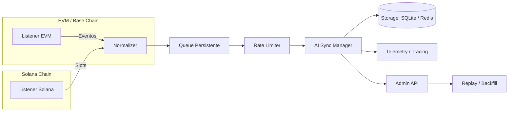

# Janus Protocol


> **Sincronização e confirmação de eventos cross-chain** entre cadeias EVM-like (ex.: Base) e Solana, com confirmação por *head/finality*, *rate limiting*, *backpressure*, *telemetria* e *replay*.

---

## Sumário
- [Visão Geral](#visão-geral)
- [Arquitetura](#arquitetura)
- [Recursos](#recursos)
- [Estrutura do Repositório](#estrutura-do-repositório)
- [Pré-requisitos](#pré-requisitos)
- [Configuração Rápida](#configuração-rápida)
- [Execução](#execução)
- [Variáveis de Ambiente](#variáveis-de-ambiente)
- [Testes](#testes)
- [Observabilidade](#observabilidade)
- [Roadmap (alto nível)](#roadmap-alto-nível)
- [Contribuindo](#contribuindo)
- [Segurança](#segurança)
- [Licença](#licença)

---

## Visão Geral
O Janus Protocol orquestra *listeners* para EVM e Solana, normaliza eventos, impõe limites de taxa e pressão, e confirma estados com base na *finality* das redes. Um *Sync Manager* aplica transformação/estado (por exemplo, *bridge messages*, *agent signals*) e persiste tudo de forma robusta. Há suporte a *telemetria*, *tracing*, *locks* distribuídos, *backfill histórico* e endpoints administrativos.

---

## Arquitetura



---

## Recursos
- **Cross-chain EVM ↔ Solana** com confirmação por *head/finality*
- **Fila persistente** com backends **SQLite** ou **Redis**
- **Rate limiting & backpressure** configuráveis
- **Reprocessamento/replay** para *backfill* histórico e recuperação
- **Locks distribuídos** (fencing) para execução segura
- **Observabilidade**: métricas (Prometheus), logs estruturados e *tracing*
- **Programa Solana** para *bridge adapter*

---

## Estrutura do Repositório

```
/api                      # API/SDKs (quando aplicável)
/apps                     # Aplicativos/CLIs auxiliares
/bridge                   # Providers, listeners, decoders, scanners
/config                   # sync.yaml, .env.* exemplos
/contracts                # Contratos EVM/Solidity
/core                     # Esquemas, interfaces, state store
/health                   # Healthchecks
/locks                    # Implementações de lock (ex.: Redis fencing)
/ops                      # Scripts/infra operacional
/packages                 # Pacotes TS/JS reutilizáveis
/programs/solana/bridge_adapter  # Programa Solana (Rust)
/rate                     # Rate limiter/backpressure
/replay                   # Serviços de replay e endpoints admin
/resilience               # Circuit breakers e estratégias adaptativas
/scripts                  # Scripts utilitários
/security                 # Políticas/artefatos de segurança
/services                 # Queue manager, sync manager, orquestração
/storage                  # Backends de fila (SQLite, Redis)
/telemetry                # Métricas, tracing e setup de observabilidade
/tests/unit               # Testes unitários
/tools                    # Ferramentas de desenvolvimento
/vendor/bridge-base-solana# Dependências vendorizadas da ponte Base↔Solana
README.md, LICENSE, CODE_OF_CONDUCT.md, CONTRIBUTING.md,
package.json, pnpm-workspace.yaml, turbo.json
```

---

## Pré-requisitos
- **Python 3.11+**
- **Node.js 18+** e **pnpm**
- **Rust & Solana CLI**
- **Redis** (opcional)
- **Foundry/Hardhat** (opcional)

---

## Configuração Rápida

```bash
git clone https://github.com/janus-protocol/janus.git
cd janus

# Python
python -m venv .venv && source .venv/bin/activate
pip install -r requirements.txt

# Node
corepack enable
pnpm install
```

---

## Execução

```bash
source .venv/bin/activate
python -m services.sync_manager
```

Listeners:
```bash
python -m bridge.listeners.evm.head_listener
python -m bridge.listeners.solana.slot_listener
```

---

## Variáveis de Ambiente

| Variável | Descrição |
|-----------|------------|
| `BASE_WS_ENDPOINT` | Node WebSocket EVM/Base |
| `SOLANA_WS_ENDPOINT` | Node WebSocket Solana |
| `REDIS_URL` | Redis connection string |
| `JANUS_ADMIN_TOKEN` | Token de acesso admin |
| `TELEMETRY_PROM_PORT` | Porta do Prometheus |
| `LOG_LEVEL` | Nível de log (INFO/DEBUG) |

---

## Testes

```bash
pytest -q
forge test
cargo test
pnpm -r test
```

---

## Observabilidade
- **Métricas**: Prometheus (`TELEMETRY_PROM_PORT`)
- **Tracing**: Jaeger, OTLP
- **Healthchecks**: `/healthz`, `/readyz`

---

## Roadmap (alto nível)
- [ ] Finality configurável por rede
- [ ] Backfill incremental
- [ ] Catálogo de decoders EVM/SPL
- [ ] CLI administrativa
- [ ] Dashboards e tracing integrados
- [ ] Testes de resiliência multichain

---

## Contribuindo
Consulte **CONTRIBUTING.md** e **CODE_OF_CONDUCT.md**.

---

## Segurança
Leia **SECURITY.md** para diretrizes de disclosure.

---

## Licença
Licenciado sob os termos definidos em **LICENSE**.
